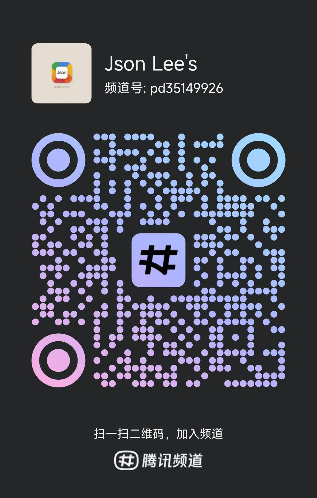

# Easy-Websocket-Client

**[English document](https://github.com/JsonLee12138/easy-websocket-client/blob/main/README.en.md)**

## 介绍

`Easy-Websocket-Client` 是一个用于管理 WebSocket 连接的库，提供了自动重连、心跳消息和事件处理等功能。

## 安装

```bash
# 使用 npm
npm install easy-websocket-client

# 使用 yarn
yarn add easy-websocket-client

# 使用 pnpm
pnpm add easy-websocket-client
```

## ⚠️ 破坏性更新 Breaking Changes

**v1.0.0** 版本移除了构造函数中的事件回调选项，现在使用事件监听器模式：

- **移除**：`onOpen`, `onClose`, `onMessage`, `onError` 构造选项
- **新增**：使用 `client.on()`, `client.once()`, `client.off()` 方法监听事件
- **新增**：`jsonAble` 选项自动解析 JSON 消息
- **新增**：`WebSocketImpl`参数, 用于支持`node`, 在`node`环境中需要传入`ws`库中的`WebSocket`
- **改进**：更好的 `TypeScript` 类型支持

## 基础使用

### 创建 WebSocket 连接

```typescript
import WebSocketClient from 'easy-websocket-client';

// 创建客户端实例
const client = new WebSocketClient('wss://example.com/socket', {
  showLog: true,
  reconnectInterval: 2000,
  heartbeatInterval: 10000,
  heartbeatMessage: 'ping',
  maxReconnectAttempts: 5,
  protocols: ['chat'],
  connectResend: true,
  jsonAble: true // 自动解析 JSON 消息
});

// 添加事件监听器
client.on('open', () => console.log('Connection opened'));
client.on('close', (e) => console.log('Connection closed', e));
client.on('message', (message) => console.log('Received message', message));
client.on('error', (error) => console.error('Error occurred', error));

// 开始连接
client.connect();

// 发送消息
client.send({ type: 'chat', content: 'Hello World' });

// 关闭连接
client.close();
```

## 单例模式的使用

在使用 `easy-websocket-client` 进行二次封装时，可以使用单例模式来确保每个页面使用相同的 WebSocket 连接，避免重复创建连接的问题。
注: 使用单例可以在所有页面或生命周期进行实例化, 可以不需要在监听中处理过多重连或刷新页面后重新连接问题, 会自动处理。

### 使用装饰器实现单例

```typescript
import WebSocketClient, { singleton } from 'easy-websocket-client';

// 你需要的获取消息的类型
interface Message {
  type: string;
  data: any;
}

@singleton
class MyWebSocketClient extends WebSocketClient {
  constructor() {
    // url 处理
    const protocol = window.location.protocol === "https:" ? "wss" : "ws";
    const host = window.location.host;
    // 处理 url 的 protocol 和 host
    const baseURL = import.meta.env.DEV
      ? "ws://" + import.meta.env.VITE_WS_HOST + ":" + import.meta.env.VITE_PORT + "/ws"
      : import.meta.env.VITE_API_URL.includes("ws") || import.meta.env.VITE_API_URL.includes("http")
        ? import.meta.env.VITE_API_URL
        : `${protocol}://${host}${import.meta.env.VITE_API_URL.includes("/") ? "" : "/"}${import.meta.env.VITE_API_URL}`;

    super(baseURL, {
      heartbeatMessage: JSON.stringify({ type: 'HEARTBEAT', textMsg: "ping" }),
      heartbeatInterval: 10000,
      maxReconnectAttempts: 3,
      connectResend: true,
      jsonAble: true // 自动解析 JSON
    });

    // 使用事件监听器而不是构造选项
    this.on('message', (data: Message) => {
      // 你的接收到的消息处理(建议使用发布订阅模式)
      console.log('Received:', data);
    });

    this.on('open', (e) => {
      // 你的连接成功处理(建议使用发布订阅模式)
      console.log('Connected:', e);
    });

    this.on('close', (e) => {
      // 你的连接关闭处理(建议使用发布订阅模式)
      console.log('Disconnected:', e);
    });

    this.on('error', (e) => {
      // 你的连接错误处理(建议使用发布订阅模式)
      console.error('WebSocket error:', e);
    });

    this.connect();
  }

  public close = () => {
    super.close();
    MyWebSocketClient.reset();
  };
}

const clientInstance = new MyWebSocketClient();
```

### 使用高阶函数实现单例（不支持装饰器的情况下）

```typescript
import WebSocketClient, { singleton } from 'easy-websocket-client';

const SingletonWebSocketClient = singleton(WebSocketClient);

const clientInstance = new SingletonWebSocketClient('wss://example.com/socket', {
  jsonAble: true,
  connectResend: true
});

// 添加事件监听
clientInstance.on('message', (data) => {
  console.log('Message received:', data);
});

clientInstance.connect();
```

## API 参考

### 构造选项

```typescript
interface WebSocketClientOptions {
  showLog?: boolean;              // 是否显示日志
  reconnectInterval?: number;     // 重连间隔(ms)，默认 1000
  heartbeatInterval?: number;     // 心跳间隔(ms)，默认 10000
  heartbeatMessage?: string;      // 心跳消息，默认 "ping"
  maxReconnectAttempts?: number;  // 最大重连次数，默认 0(无限)
  protocols?: string[];           // WebSocket 协议
  connectResend?: boolean;        // 重连后重发消息，默认 false
  jsonAble?: boolean;             // 自动解析 JSON，默认 false
}
```

### 事件类型

- `open`: 连接建立时触发
- `close`: 连接关闭时触发
- `message`: 接收到消息时触发
- `error`: 发生错误时触发

### 方法

- `connect()`: 建立连接
- `send(message)`: 发送消息
- `close()`: 关闭连接
- `on(event, listener)`: 添加事件监听器
- `once(event, listener)`: 添加一次性事件监听器
- `off(event, listener)`: 移除事件监听器
- `offAll()`: 移除所有事件监听器

## 📝 贡献指南
欢迎提交`issue`或`pull request`，共同完善`Easy-Websocket-Client`。

## 📄 许可证

MIT

## 联系我们

- [Discord](https://discord.gg/666U6JTCQY)
- [QQ频道](https://pd.qq.com/s/fjwy3eo20?b=9) [](https://pd.qq.com/s/fjwy3eo20?b=9)
